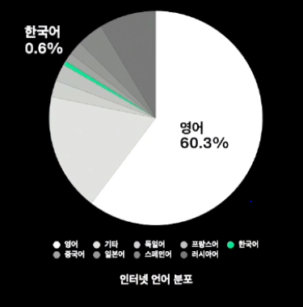
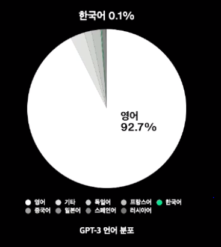

# HyperCLOVA의 한국어 모델

한국어 모델을 만든 이유

- 현 GPT-3는 학습 데이터 구성상 한국어 성능이 제한적
- 
- 
- GPT-3는 사실상 영어 기반의 거대 모델이라고 할 수 있음
- GPT-3는 대부분의 NLP 문제에서 뛰어난 성능을 보임
- 한국어에 맞는 거대 모델을 확보하지 못한다면 글로벌 기업들이 다양한 서비스를 제공해도 우리는 제한적인 한국어 서비스를 이용할 수 밖에 없음
  - 이는 기술이 종속되는 문제가 있음
  - 또 한국어 서비스에 제한이 생기는 문제가 있음

​     

언어모델은 학습한 데이터 종류 및 품질에 따라 언어를 이해하고 글을 쓰는 능력이 매우 달라짐

- ex) 뉴스만으로 학습한 모델을 구어체 사용에 제한이 있음

-> Corpus Mixer를 구축하여 전처리 시 데이터 종류별 비율 자동 조절 처리

​     

데이터를 binary로 변환하는 serializing 필요

-> 하둡 스트리밍을 적용하여 기존 7일 걸리던 데이터 전처리 프로세스를 1시간으로 단축시킴

​     

모델 크기를 키우기 위해 3중 병렬화 적용

3중 병렬화(데이터, 모델, 파이프라인)

- 모델 학습 시 데이터를 batch, attention, layer 측면으로 쪼개 각각의 GPU에서 연산
- gradient 계산 및 파라미터 업데이트 시에는 연산 결과를 합쳐서 진행