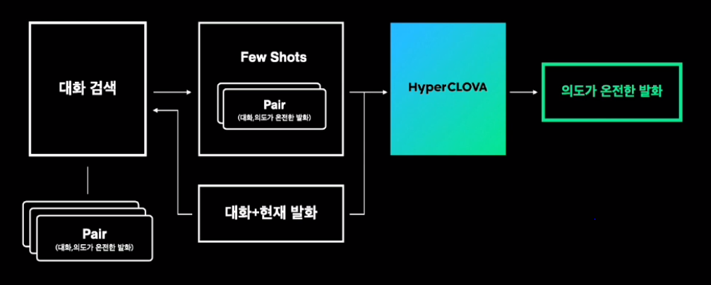
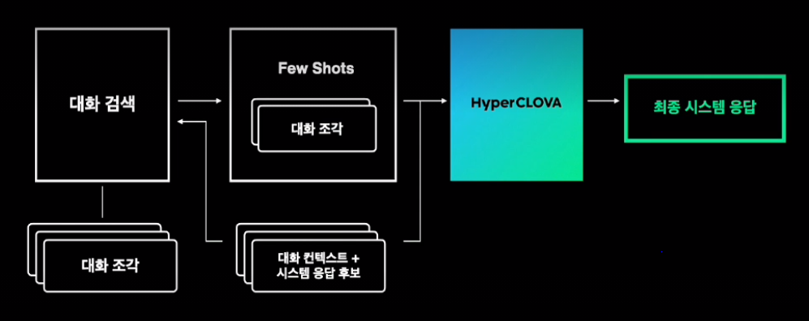

# HyperCLOVA의 활용 (2) AI 어시스던트

AI 어시스던트가 처리하는 대화의 유형

- Goal Oriented Dialogs
  - 사용자의 특정목적 만족을 위한 대화
- Question Answering
  - 질문에 전문 지식으로 응답
- Chit-Chat Dialogs
  - 목적성이 없는 일상 대화

-> AI 어시스던테는 이들의 결과를 병렬적으로 생성 후 Selector에서 최적의 응답 선택

​     

HyperCLOVA를 이용해 AI 어시스던트가 얻고자하는 것

1. 자연스러운 대화
   - 여러 턴의 대화 맥락 이해
2. 보다 많은 지식
   - 비정형화된 텍스트로부터 학습

​     

AI 어시스던트를 보다 자연스러운 대화 인터페이스로 만들기 위한 세부 기술

1. 대화 이해
   - 대화 이해를 위한 컨택스트 주입
2. 시스템 응답 선택
   - 여러 시스템 응답 후보 중 가장 맥락에 맞는 응답 선택
3. 시스템 응답 생성
   - 적절한 시스템 응답 생성을 위한 조율 방법

​     

대화 이해

- 이전의 대화 내용이 이후 대화에 영향을 미침
- 대화 내 대명사나 지시용어의 원래 대상을 찾기 위해 대용어 해소 및 생략 복원 기술, 대화 상태 추적 기술 활용
- 하나의 문장에 완전한 사용자의 의도를 담애내기 위해 이전 대화의 컨택스트를 주입
- 

​     

시스템 응답 선택

- 하나의 사용자 입력에 의해 각 대화 유형별, 도메인별로 2개 이상의 답변이 생성 될 수 있음

- Selector 모듈로 여러 응답 중 더 적절한 응답을 선택함

- HyperCLOVA 모델을 Transformer Network의 decoder 만으로 구성되어 있다고 할 수 있음

  -> 이 decoder는 주어진 텍스트의 각 토큰의 likelihood를 구하는 용도로 활용 가능

  -> 동일한 대화 컨택스트가 주어졌을 때 시스템 응답 후보들에 대해 decoder의 likelihood 값을 계산하여 가장 큰 값을 갖는 것이 더 적절한 응답이라고 판단

- 

​     

future work

- 실서비스 적용을 위한 최적화
- 멀티턴 대화에 자연스러운 적절한 vux 탐색
  - 매번 호출 시 "헤이 클로바"를 사용하지 않아도 되게끔
- 품질 향상과 효과적인 제어를 위한 최신 기술 적용