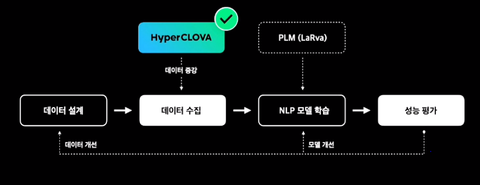

# HyperCLOVA의 활용 (4) 데이터 증강

자연어처리 패러다임의 변화

- 기존 : 데이터 설계 -> 데이터 수집 -> NLP 모델 학습 -> 성능평가 -> 데어터/모델 개선
  - PLM(pretrained Language Model)으로 특정 도메일 혹은 문제를 푸는 NLP 모델로 fine-tunig 하는 패러다임
- HyperCLOVA
  - fine-tunning 패러다임에 적용하는 것의 한계 : HyperCLOVA를 수용할 수 있는 컴퓨팅 환경의 접근성
    - 모델의 파라미터 수가 대단위로 넘어가면서 back-propagation 등의 작업을 진행하기에는 컴퓨팅 자원의 턱 존재
    - 새로운 NLP 모델 확장시 초대형 모델 파라미터를 별도로 저장해야 하는 확장성 문제
  - HyperCLOVA 전체를 파인튜닝하는 대신 프롬프트를 활용한 방안
    - HyperCLOVA는 in-context learning이 가능
    - 프롬프트를 통해 소량의 예시만으로 학습이 가능
    - 최근에는 프롬프트 관련 기술이 발전하여 파인튜닝과 비슷한 성능을 낼 수 있다는 연구도 있음
    - 학습 시간이 상대적으로 훨씬 짧아질 수 있다는 장점이 있음
  - 프롬프트 방안의 한계
    - 파인튜닝과 동일한 한계 - 직접 모델을 다루고자 할 때 컴퓨팅 자원의 턱 존재
    - 최신 프롬프트 기술(prefix-tuning 등) 적용 시 극소량의 파인튜닝 필요
    - 언어 모델은 프롬프트 설계에 따라 민감하게 반응하기 때문에 모델 통제가 어렵거나 결과 해석이 어려울 수 있음

​     

HyperMix : HyperCLOVA를 이용한 텍스트 증강 기법

- 파인튜닝과 프롬프트의 대안으로 HyperMix 제시
- HyperMix는 HyperCLOVA를 통해 기존 데이터를 변형 / 확장하고 NLP 모델에 전이하는것으로 목표로 함
- 
- HyperMix를 통해 통산적인 NLP 파이프라인에서 데이터 수집에 투입되는 공수 감소 및 언어 모델을 직접적으로 인퍼런스 하지 않음으로 모델 경량화 가능
- 기존 파인튜닝 패러다임에서 크게 벗어나지 않기 때문에 HyperCLOVA 수용을 위한 변화 비용 최소화 가능

​     

HyperMix 작동 방식

1. 주어진 NLP 문제의 특성이 잘 반영된 HyperMix 프롬프트 템플릿 제작(해당 문제의 정의나 메타정보가 포함될 수 있음)
2. 기 확보된 데이터에 있는 예시를 선별하여 HyperMix 전용 프롬프트 템플릿과 합성
3. HyperCLOVA의 완성 기능을 통해 새로운 예시 생성
4. 합성된 예시 문구와 HyperCLOVA가 부착한 분류 정보 추출
5. 작업 반복

-> 새롭고 다양한 예시와 정확한 분류정보를 얻을 수 있음

-> 기존 데이터와 섞으면 다운스트림 NLP 모델을 파인튜닝하는데 사용할 수 있음

​     

HyperMix의 효용성

- HyperMix의 프롬프트 설계가 중요할까?
  - 문제 정의가 잘 드러나도록 설계된 프롬프트와 그렇지 않은 프롬프트 간 다운스트림 대스크 성능 차이 존재
- HyperMix에 혼합되는 예시 수가 중요할까?
  - 다수의 예시를 혼합하는 것이 유리
  - 예시 수가 일정수준을 넘어서면 HyperCLOVA가 오버피팅되어 생성 다양성이 감소하고 data augmentation 효용 감소됨