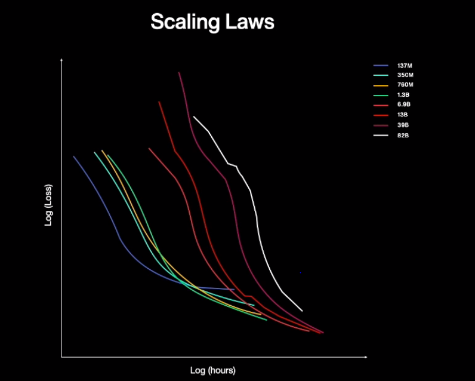

# 새로운 AI의 시작, HyperCLOVA

HyperCLOVA

- 최초의 한국어 초거대 언어모델
- 5600억 토큰의 한국어 데이터 학습
  - 한국어 위키피디아 2900배
  - 뉴스 50년 치
  - 블로그 9년 치
- 기존 네이버의 언어모델 대비 600배 규모

​      

BIG AI가 가능해진 이유

- 비지도학습방법론
- 지도 학습은 데이터를 일일히 라벨링해야하기 때문에 학습 속도에 제한이 있었음
- 비지도학습은 사람이 알려준 데이터 없이도 학습 가능하기 때문에 대규모의 다양한 데이터 활용에 유리

​     

인공지능 성능

- Scaling Laws에 따르면, 데이터의 양, 연산의 규모, 모델의 파라미터 수 이 세가지가 서로 병목이 되지 않는다는 전제하에서 인공지능의 성능은 무한히 성장할 수 있다고 함
- 
- 작은 모델보다 큰 모델의 효율이 오히려 더 높아지는 지점도 있음

​     

프로젝트 사례

1. 맥락을 이해하는 자연스러운 대화
   - 이러한 대화 시스템을 위해 별도의 데이터셋을 제작할 필요가 없었다는것이 주목할만한 지점
   - 과거의 대화를 이해해서 지속적으로 대화 가능
2. 창작을 도와주는 글쓰기
   - 여러가지 유형의 글을 학습해서 예시 문장을 만들거가 이미 써놓은 문장의 스타일 변경 가능
   - 키워드 만으로 소개글 작성 가능
     - ex) #강아지간식, #고양이간식 -> 댕냥이와 함께하는 즐거운 간식시간!
   - 서비스(스마트스토어 등) 적용 및 노출 적합도 채택률 99% 정도의 성능을 보임
3. 정보 요약
   - 여러 문서에서 여러 의견을 요약해서 빠른 이해를 돕도록 서비스
4. 데이터 생성
   - AI 개발 프로세스 가속 가능

​     

=> AI 활용이 더 빠르고 쉬워졌다

AI 엔지니어가 아닌 기획자가 ideation하고 실제 기능도 만들어낼 수 있음