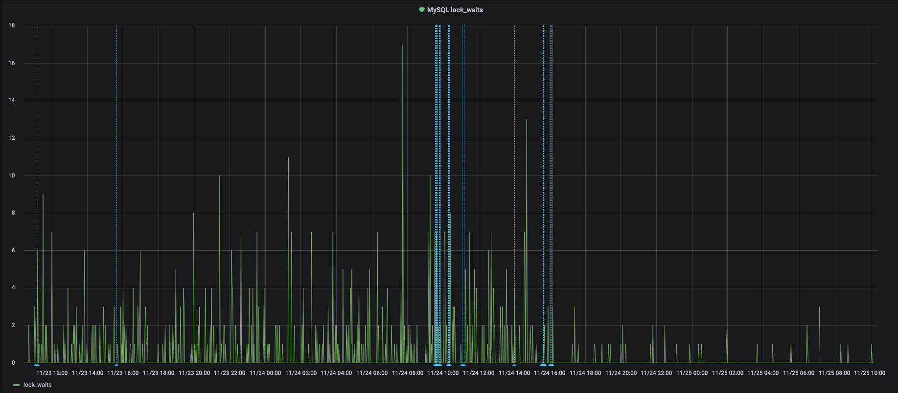

# MySQL Error Code 2013
       
## 에러 발생 상황
- AWS RDS 인스턴스로 띄운 MySQL 사용 중 `Error Code: 2013. Lost connection to MySQL server during query` 라는 에러메세지를 받게됨
- 해당 에러 이전에는 특정 테이블에서 lock이 자주 걸리는 이슈가 있었음
	- 애플리케이션 수준에서 쿼리를 수정해봤지만 여전히 문제를 해결하지 못함
	- 우선적인 조치로 lock이 탐지되면 강제로 lock을 풀어버리도록 처리(별도 스크립트를 돌려서)
	- 요건 이후에 해결하게 되면 따로 기록을 다시 남길 예정
- 해당 에러메세지를 받은 서버는 이전에는 잘 동작하다가 최근들어 갑자기 문제가 발생한 것으로 파악됨
- 같은 MySQL 서버를 바라보고 있는 별도의 서버들이 다수 있고 커넥션 또한 자주 맺고 끊어지는것 확인
       
## 에러 발생 원인
우선 MySQL 공식문서에서는 아래 3개가 주요 원인일 것이라고 나와있음   
- <i>Notes: https://dev.mysql.com/doc/refman/5.7/en/error-lost-connection.html</i>
      
1. 네트워크 연결 문제
	- 모니터링 결과 에러 발생 시 네트워크 문제는 없는것으로 판단됨
2. 쿼리의 크기(millions of rows)가 커서 read하는데 시간이 오래걸릴 때
	- 해당 에러를 받은 서버에서 `SELECT`로 가져오는 row의 수가 1000개를 넘지않는 것을 확인
	- 별도 스크립트로 해당 쿼리를 실행했을 때 걸리는 시간은 0.04초 미만이고 `net_read_timeout` 설정값은 default로 30으로 설정되어 있기 때문에 문제 될 게 없다고 판단됨
3. `connect_timeout`이 짧아 클라이언트가 초기 연결 시도 시 DB 서버에서 연결을 끊어버리는 경우
	- `connect_timeout` 설정값은 default값이 아닌 10초로 설정되어 있는 것 확인
	- `aborted_connections` 값을 확인했을 떄는 200 이상인 것 확인
	- DB와 연결을 맺고 끊는데 있어서 문제가 있는게 확실한것으로 보임

## 에러 해결 과정
1. DB 인스턴스에서 파라미터 확인
	- DB 인스턴스 접속 후 터미널에서 또는 Datagrip에서 콘솔 열어서 확인(AWS RDS 파라미터 그룹에서도 확인 가능)
		- `show variables like 'connect_timeout'; `
		- `show global status like 'aborted_connects';`
		- `show variables like 'max_connections';`
		- `show variables like 'wait_timeout';`
		- `show processlist;`
	- 부가적으로 DB lock 확인
		- `SELECT * FROM information_schema.innodb_lock_waits ORDER BY blocking_trx_id;`
		- `SELECT * FROM information_schema.INNODB_TRX;`
		- `SELECT * FROM information_schema.PROCESSLIST WHERE state <> '' ORDER BY TIME DESC;`       
       
	-  <b>`max_connections`이 값은 2000으로 설정되어 있고 RDS 모니터링에서 확인 시 맺고 있는 연결의 수가 1000미만이기 때문에 충분해 보임</b>
	-  <b>`wait_timeout`은 30분으로 꽤나 길게 설정되어 있어 줄일 필요가 있어보임(사용하지 않는 시점부터 연결을 끊기까지 기다리는 시간인데 너무 길 경우 필요하지 않은 연결을 너무 오래 붙들고 있는 것)</b>
	-  <b>`processlist`를 확인했을 때 특정 테이블에서 query를 할 때 시간이 꽤 오래걸리는게 확인됨. 해당 테이블은 거의 select만 많이 수행되는데 index가 걸려있지 않음</b>
2. 어플리케이션 단계에서 DB 연결 방법 수정
	- Python 코드에서 `PyMySQL` 라이브러리 사용으로 매번 연결을 맺고 끊던 것을 `aiomysql` 라이브러리를 사용해서 connection pool을 사용하도록 수정
	- 해당 서버는 ECS, ELB로 관리되는데, ELB에서 서버 health check하는 엔드포인트에 DB connection ping 코드 추가
		- pool로 관리하고 있는 DB 연결이 ping 실패시 ELB에서는 health check fail로 판단하기 때문에 ECS 서비스 인스턴스 재부팅됨
		- ECS 서비스 인스턴스 재부팅 시 기존 DB 연결이 모두 끊어지고 새로 연결을 맺어서 해당 에러를 뱉지 않는것으로 보여 이렇게 처리
	- <b>해당 작업 후 모니터링했을 때 해당 서버에서는 2013 에러가 발생하지 않는것으로 보임</b>
	- <b>하지만 추후 작업 및 다른 서버에서 이같은 문제가 발생하지 않는다는 보장이 되지 않아 DB 테이블 및 파라미터 수정은 필요한것으로 판단됨</b>
		- 이슈가 발생하는 테이블에 index 추가 및 `wait_timeout` 값 수정
		- 또 DB lock이 자주 걸리고 이를 강제로 풀어주는 것이 그 자체로 문제이기도 하고 이번 에러에 영향을 주는 것 같아 해당 문제 해결 필요
3. 해당 DB 테이블에 index 추가
	- index 추가 및 칼럼 추가를 위해 테이블 `ALTER` 수행 시 `metalock`이 걸림
		- 해당 테이블이 다른 서버(worker) 및 스크립트에서 지속적으로 사용되고 있어 row lock이 계속 걸려 있는 상황
		- 테이블 `ALTER` 시 table lock을 잡는데 row lock이 모두 풀릴 때까지 기다려서 table lock이 풀리지 않음
		- 부가적으로 *workbench*를 사용해서 `ALTER`를 했을 때 2013 에러 발생하고 meta lock은 지속되는것이 확인되어 기존 2013 에러도 클라이언트에서 DB 서버에서 `response`를 받지 못해서 클라이언트 측에서 연결을 끊어버려 발생한 것이라는게 확인됨
	- `show engine innodb status;` 쿼리로 deadlock 확인하고 해당 쿼리에 따라 해당 칼럼에 index 추가
	- 그 결과 아래 사진처럼 lock wait의 빈도 및 시간이 줄어드는 것 확인
	
4. DB 파라미터 설정값 수정
	- AWS RDS에서 해당 DB 파라미터 적용 유형 확인 시 `dynamic`으로 되어있어 인스턴스 재기동 없이 적용가능하다는것 확인
		- `static`으로 되어있을 경우 인스턴스 재기동이 필요
		- `character_set_client`, `timezone`의 경우 파라미터 적용 유형이 `dynamic`일지라도 인스턴스 재기동 후에 적용된다고 함(다른 팀에서 경험한 부분)
		- notes: https://docs.aws.amazon.com/ko_kr/AmazonRDS/latest/UserGuide/USER_WorkingWithParamGroups.html
	- 워크로드에서의 쿼리 부하를 살펴보기 위해 `slow_query_log` 값을 1로 변경하고, `slow_query_log_file` 값 지정
	- `wait_timeout` 값을 1800(30분)에서 300(5분)으로 변경