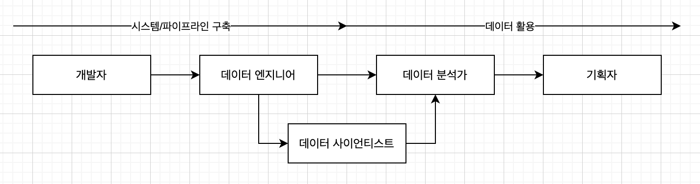

# 데이터 관련 직군 정리
      
## 데이터 관련 직무의 차이
1. Data Analyst
	- 비즈니스 기반의 문제 해결. 다양한 지표를 통해 현 상황과 추세를 확인하여 비즈니스 결정을 도움
	- 현업팀 필요 데이터 추출
	- 유용한 지표 구축
	- 가설 설정 및 실험 계획
2. Data Scientist
	- ML/AI 활용, 수학적 모델 및 알고리즘 구축
	- 주로 석박사 출신
	- ex)추천 시스템, 고객 자동 클러스터링, 자연어 처리(NLP), 시각 정보 처리 등
3. Data Engineer
	- 데이터를 잘 활용할 수 있도록 효율적으로 쌓는 사람
	- 데이터 파이프라인(DM/DW) 구축
 

     
## Data Analyst의 자격요건
- 인사이트 도출 : 전락적 사고, 도메인에 대한 지식
- 실험 계획 및 결과 해석 : 통계적 사고, 데이터 추출을 위한 코딩 능력
- 데이터 시각화 및 커뮤니케이션 : 개발/현업팀과의 커뮤니케이션 능력
      
## 상세 역할
1. TF에 속해 있을 경우
	- 실험 Cycle을 통한 서비스 개선
	- 명확한 가설을 세워 실험하기
	- 현상황/문제점 파악
	- 실험 기획/검증 및 피드백 반영
	- 핵심 지표 설정(OMTM/KPI 등 설정)
	- 현업팀 업무에 필요한 데이터 추출
2. Furthermore
	- Data-Driven 문화 구축
	- DA팀이 추출이 아닌 분석에 집중할 수 있는지, 커뮤니케이션 코스트를 줄 일 수 있는지
	- 거시적인(서비스 전반의) 분석 시행
	- 문제를 파악하여 전략적인 측면 제언
      
## 기본 필요 역량
- SQL/Python 핸들링
- 통계학적 지식
- 도메인 지식 (기획, 사업, 마케팅)