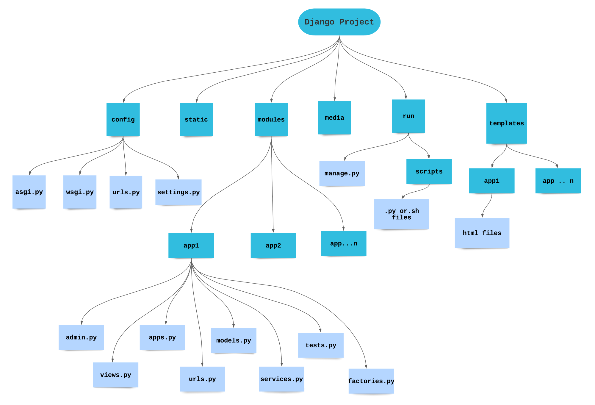

# Django Project Architecture
    

         
## Unconventional files
    
- *services.py*
	- 비즈니스 로직 또는 유틸성 함수 작성
	- 로직 중복을 피할 수 있고, 코드를 모듈화해서 사용할 수 있다는 장점이 있음
	- 결과적으로, 주로 많이 사용되는 views.py를 간결하게 작성하고 관리할 수 있음

- *factories.py*
	- super class 및 abstract method 작성
	- sub class의 부담을 줄일 수 있고, 추후 변화에 있어서 조금 더 유연하게 대처 가능
     
## Notes
- https://rajanmandanka.medium.com/django-project-architecture-the-best-project-skeleton-ever-a184143f1c82