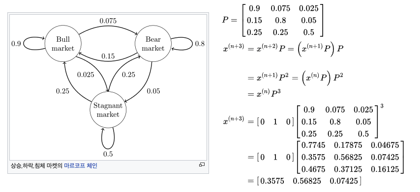

# 마르코프 행렬(Markov Matrix)

이 행렬은 확률론적 방법으로 전개되므로 확률 행렬(Stochastic matrix)로도 잘 알려져 있다.(= transition matrix / substitution matrix)

이 행렬을 통해 현재 상태에서 다른 상태로의 변동 확률을 가지고 시간 또는 시도횟수에 따라 상태가 어떻게 변화할지를 모델링할 수 있다. 

​     

- 예시

​     

- 특성
    - 모든 원소의 값이 0보다 크거나 같다.
    - 각 column의 원소 합이 1이 된다.
    - 정상 상태(steady state) 특성을 가진다.
        - 행렬 거듭제곱 시에도 정상 상태 유지 조건
            1. 적어도 하나의 고유값은 1이다.
            2. 나머지 고유값들은 1보다 작은 값을 가진다.
        - λ=1에 대응되는 고유벡터

​     

특성 중 2번째, 각 column의 원소 합이 1이 된다는 조건으로부터 고유값이 1이어야 한다는 것을 설명할 수 있다.

- A라는 마르코프 행렬이 있을때
- A-I는 각 column의 합이 0이 된다. → A-I는 특이행렬(singular matrix)
- A-I 행렬의 row들은 dependent하다. → 전치시켰을 때 null space(정확히는 left null space) 존재
- A-I가 left null space를 가진다면(A-I의 전치가 null space를 가진다면), A-I는 full-rank가 아니다
- A-I가 full rank가 아니라면, A-I의 column도 dependent하다.
- A-I의 column이 dependent 하다면, A-I도 null space를 가진다.
- A-I의 null space 는 (A-I)x = 0을 만족시키는 x값들이고, λ=1이므로 이에 대응되는 고유벡터 x가 null space

​     

데이터 분석에서의 마르코프 행렬 활용 예

- 시장점유율 예측
    - ex. 아이폰과 갤럭시의 한국 시장 점유율 예측

​     

참고: [https://twlab.tistory.com/53](https://twlab.tistory.com/53)